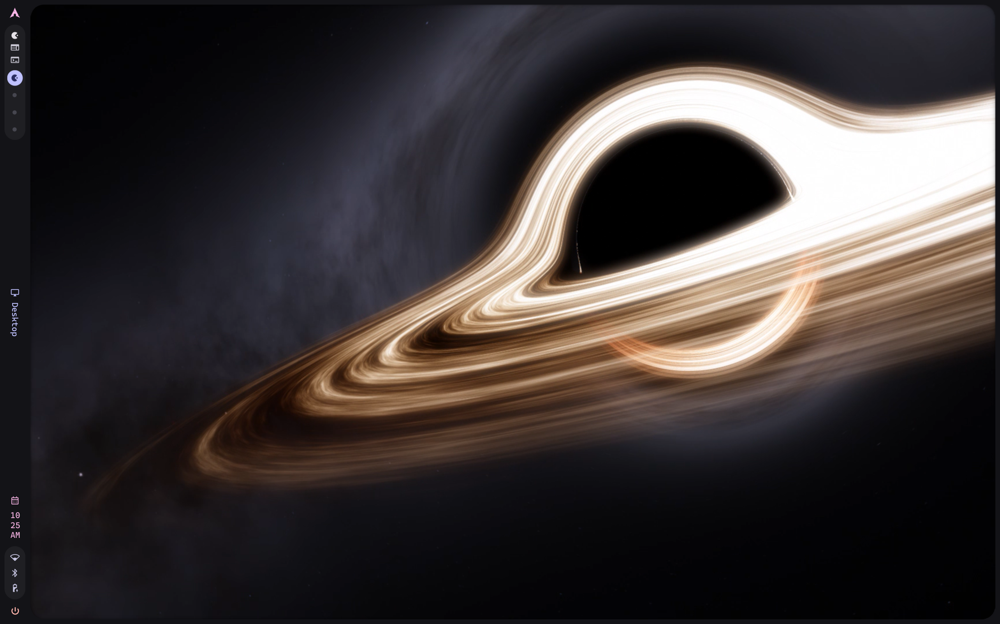
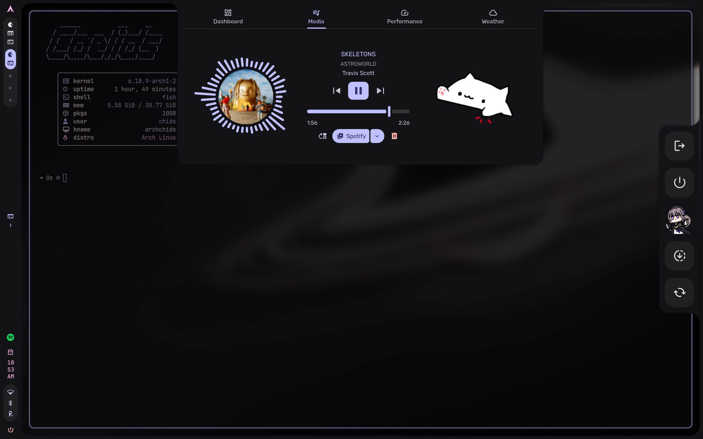

# Caelids

This is a modified repo of the main caelestia dots and contains the modified configs and files for my personal installation. This repo also includes an install script to install the entire dots.

## Screenshots




## Installation

Simply clone this repo and run the install script (you need
[`fish`](https://github.com/fish-shell/fish-shell) installed).

> [!WARNING]
> The install script symlinks all configs into place, so you CANNOT
> move/remove the repo folder once you run the install script. If
> you do, most apps will not behave properly and some (e.g. Hyprland)
> will fail to start completely. I recommend cloning the repo to
> `~/.local/share/caelestia`.

The install script has some options for installing configs for some apps.

```
$ ./install.fish -h
usage: ./install.sh [-h] [--noconfirm] [--spotify] [--vscode] [--discord] [--aur-helper]

options:
  -h, --help                  show this help message and exit
  --noconfirm                 do not confirm package installation
  --spotify                   install Spotify (Spicetify)
  --vscode=[codium|code]      install VSCodium (or VSCode)
  --discord                   install Discord (OpenAsar + Equicord)
  --zen                       install Zen browser
  --aur-helper=[yay|paru]     the AUR helper to use
```

For example:

```sh
git clone https://github.com/caelestia-dots/caelestia.git ~/.local/share/caelestia
~/.local/share/caelestia/install.fish
```

### Manual installation

Dependencies:

-   hyprland
-   xdg-desktop-portal-hyprland
-   xdg-desktop-portal-gtk
-   hyprpicker
-   wl-clipboard
-   cliphist
-   inotify-tools
-   app2unit
-   wireplumber
-   trash-cli
-   foot
-   fish
-   fastfetch
-   starship
-   btop
-   jq
-   eza
-   adw-gtk-theme
-   papirus-icon-theme
-   qt5ct-kde
-   qt6ct-kde
-   ttf-jetbrains-mono-nerd

Install all dependencies and follow the installation guides of the
[shell](https://github.com/caelestia-dots/shell) and [cli](https://github.com/caelestia-dots/cli)
to install them.

> [!TIP]
> If on Arch or an Arch-based distro, there is a meta package available [in this repository](PKGBUILD)
> that pulls in all dependencies. It can be installed through the install script, makepkg/pacman, yay,
> paru, or your preferred AUR helper.

Then copy or symlink the `hypr`, `foot`, `fish`, `fastfetch`, `uwsm` and `btop` folders to the
`$XDG_CONFIG_HOME` (usually `~/.config`) directory. e.g. `hypr -> ~/.config/hypr`.
Copy `starship.toml` to `$XDG_CONFIG_HOME/starship.toml`.

## Updating

Simply run `yay` to update the AUR packages, then `cd` into the repo directory and run `git pull` to update the configs.

## Usage

> [!NOTE]
> These dots do not contain a login manager (for now), so you must install a
> login manager yourself unless you want to log in from a TTY. I recommend
> [`greetd`](https://sr.ht/~kennylevinsen/greetd) with
> [`tuigreet`](https://github.com/apognu/tuigreet), however you can use
> any login manager you want.

There aren't really any usage instructions... these are a set of dotfiles.

Here's a list of useful keybinds though:

-   `Super` - open launcher
-   `Super` + `>` - open launcher additional settings
-   `Super` + `#` - switch to workspace `#` (number)
-   `Super` `Alt` + `#` - move window to workspace `#` (number)
-   `Super` + `Q` - open terminal (foot)
-   `Super` + `B` - open browser (firefox)
-   `Super` + `M` - open spotify in a special workspace
-   `Super` + `D` - open discord
-   `Super` + `Alt` + `W` - change active wallpaper
-   `Super` + `Alt` + `M` - mute/ unmute the wallpaper
-   `Super` + `C` - close window
-   `Super` + `S` - toggle special workspace or close current special workspace
-   `Ctrl` `Alt` + `Delete` - open session menu
-   `Ctrl` `Super` + `Space` - toggle media play state
-   `Ctrl` `Super` `Alt` + `R` - restart the shell
